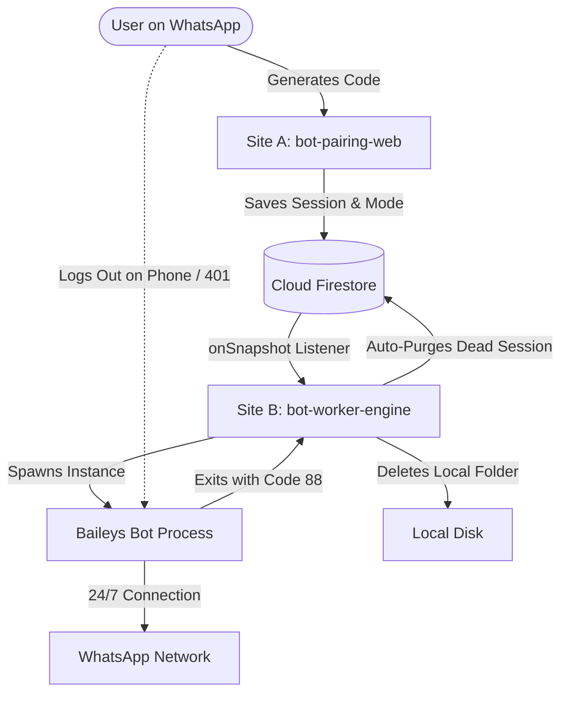

# Project Structure — Distributed Multi-Site Architecture

This document provides a comprehensive overview of the **Skybee Distributed WhatsApp Bot Platform** architecture, directory layout, ground site files (`bot-pairing-web`), standalone bot engine files (`bot-worker-engine`), and cloud synchronization infrastructure.

---

## 📁 Repository Directory Tree

```text
bot-site/
├── .firebaserc                          # Firebase project configuration
├── .gitignore                           # Git ignore rules (credentials & temp caches)
├── MULTI_SITE_BOT_ARCHITECTURE_BLUEPRINT.md # Master distributed architecture blueprint
├── PROJECT_STRUCTURE.md                 # Project architecture & component documentation
├── README.md                            # Repository onboarding & run guide
│
├── 🌐 bot-pairing-web/                   # SITE A: Web Pairing & Management Portal
│   ├── index.js                         # Express Pairing API & WhatsApp Handshake Server
│   ├── firebaseSync.js                  # Cloud Firestore sync & session persistence
│   ├── package.json                     # Standalone Web API dependencies
│   ├── package-lock.json                # Pinned dependency lockfile
│   ├── render.yaml                      # Render.com cloud deployment config
│   ├── vercel.json                      # Vercel frontend deployment config
│   ├── README.md                        # Site A setup & deployment guide
│   └── public/                          # Static Frontend Web UI
│       ├── index.html                   # Default Homepage (Client Store & Activation Portal)
│       ├── store.html                   # Client Storefront & Pairing Code / QR Generator
│       ├── admin.html                   # Secure Admin Dashboard & Approval Switcher
│       ├── admin-pair.html              # Dedicated Admin Pairing Gate
│       ├── router.html                  # Multi-cluster failover router
│       ├── style.css                    # UI styling, glassmorphism & responsive design
│       ├── logo.png                     # Site branding logo (PNG)
│       └── logo.jpg                     # Site branding logo (JPG)
│
└── 🤖 bot-worker-engine/                 # SITE B: 24/7 Dedicated Multi-Bot Runner
    ├── cloud-worker.js                  # Real-time Firestore session listener & multi-bot daemon
    ├── bot-engine.js                    # Multi-device Baileys engine with LID & signal fault tolerance
    ├── cypher.js                        # Core Baileys connection & command dispatcher
    ├── index.js                         # Standalone bot entrypoint
    ├── cloud-start.js                   # Single-session cloud loader
    ├── system.js                        # System utilities, configurations & database setup
    ├── package.json                     # Bot dependencies & scripts (Baileys, ffmpeg, etc.)
    ├── package-lock.json                # Bot lockfile
    ├── README.md                        # Site B setup & deployment guide
    ├── lib/                             # Media conversion & stream utility helpers
    │   ├── catbox.js                    # File uploading to Catbox.moe
    │   ├── color.js                     # Terminal color formatter
    │   ├── converter.js                 # Audio/Video conversion utilities (ffmpeg)
    │   ├── exif.js                      # Sticker EXIF metadata modifier
    │   ├── myfunc.js                    # General utility & stream parsing functions
    │   └── remini.js                    # Image enhancement tool
    │
    └── plugins/                         # 🔌 Modular Command Plugins (26 plugins)
        ├── ai.js                        # AI chat & image generation handlers
        ├── alive.js                     # Bot uptime and live ping check
        ├── anticall.js                  # WhatsApp auto-call rejection & blocker
        ├── antidelete.js                # Deleted message logger & media recovery
        ├── autostatus.js                # WhatsApp status auto-view & emoji reactions
        ├── bible.js                     # Scripture & Bible reference lookup
        ├── clearsessions.js             # Stale session cleanup utility
        ├── downloader.js                # Universal media / video / audio downloader
        ├── group.js                     # Full Group Administration & Moderation Suite
        ├── ig.js                        # Instagram media & Reels downloader
        ├── link.js                      # WhatsApp invite link handlers
        ├── menu.js                      # Interactive command menu generator
        ├── motivation.js                # Motivational quotes & 24/7 mindset broadcaster
        ├── movie.js                     # Movie & IMDb lookup
        ├── ping.js                      # Response latency check
        ├── play.js                      # Music / YouTube audio stream fetcher
        ├── quran.js                     # Quran recitation & verse lookup
        ├── react.js                     # Auto-reactions to messages
        ├── restart.js                   # Safe bot reboot & plugin reload command
        ├── session.js                   # Session ID generator & validator
        ├── sticker.js                   # Image/video to WhatsApp sticker maker
        ├── tagall.js                    # Group mention tool
        ├── tiktok.js                    # TikTok video downloader (no watermark)
        ├── tomp3.js                     # Video/audio to MP3 converter
        ├── vv.js                        # View-Once bypass & in-memory key retriever
        └── welcome.js                   # Group join/leave greeting messages
```

---

## 🌐 1. Site A: Ground Site (`bot-pairing-web/`)

These files handle user interactions, client activation, web dashboard management, and WhatsApp pairing over HTTP/WebSocket:

* **`bot-pairing-web/public/index.html` / `store.html`**: The public default homepage where visitors input their phone number to generate an 8-digit WhatsApp pairing code or scan a QR code with zero friction.
* **`bot-pairing-web/public/admin.html`**: Secure administrative dashboard for approving bots, toggling launch modes (`⚡ INSTANT` vs `🛡️ APPROVAL`), monitoring live logs, and managing bot instances.
* **`bot-pairing-web/index.js`**: The primary Express server. It hosts the REST endpoints, coordinates `@whiskeysockets/baileys` socket pairing, syncs authenticated sessions to Firebase Firestore, and manages local instances when running in unified mode.
* **`bot-pairing-web/firebaseSync.js`**: Cloud Firestore sync module that backs up sessions, manages approval statuses, synchronizes system modes, and handles automatic session deletion when a user logs out.

---

## 🤖 2. Site B: Bot Core Engine (`bot-worker-engine/`)

These files control 24/7 WhatsApp socket connectivity, message interception, command parsing, and execution:

* **`bot-worker-engine/cloud-worker.js`**: The 24/7 multi-bot runner. Connects to Firestore, listens in real time for new/updated sessions from Site A, and automatically spawns/manages bot child processes with automatic supervisor recovery.
* **`bot-worker-engine/bot-engine.js`**: Primary Baileys WhatsApp client runner. Handles incoming messages, event listeners, message un-wrapping, group metadata caching, and Signal LID fault tolerance.
* **`bot-worker-engine/plugins/group.js`**: Complete group administration plugin supporting `.group`, `.open`, `.close`, `.hidetag`, `.tagall`, `.kick`, `.promote`, `.demote`, `.link`, `.revoke`, `.setname`, `.setdesc`, `.welcome`, and `.antilink`.
* **`bot-worker-engine/plugins/vv.js`**: View-Once bypass plugin that pulls original encryption keys from memory (`messageStore`) and delivers unlocked photos/videos directly to chat.
* **`bot-worker-engine/plugins/restart.js`**: Allows the bot owner to safely reboot their bot instance from WhatsApp chat (`.restart` / `.reboot`) and reload all plugins in 3–5 seconds.

---

## ☁️ 3. Cloud Synchronization & Auto-Purge Lifecycle



1. **Pairing Handshake:** Site A generates 8-digit codes and writes session tokens to Firestore (`sessions/<phone>`).
2. **Real-time Listener:** Site B receives snapshot updates from Firestore and launches the bot process within 2 seconds.
3. **Fault-Tolerant Execution:** Messages sent with LID IDs (`@lid`) or disappearing messages are automatically handled without `No sessions` crashes.
4. **Auto-Purge on Logout:** When a user logs out on WhatsApp (*Error 401*), the dead session is automatically deleted from disk, vault, and Cloud Firestore.
